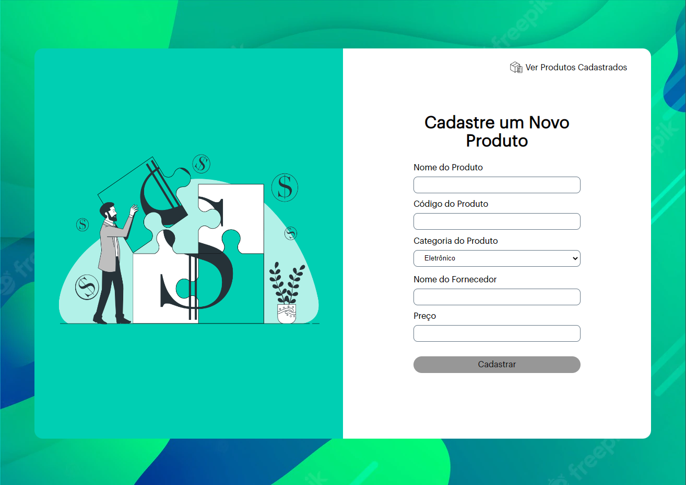
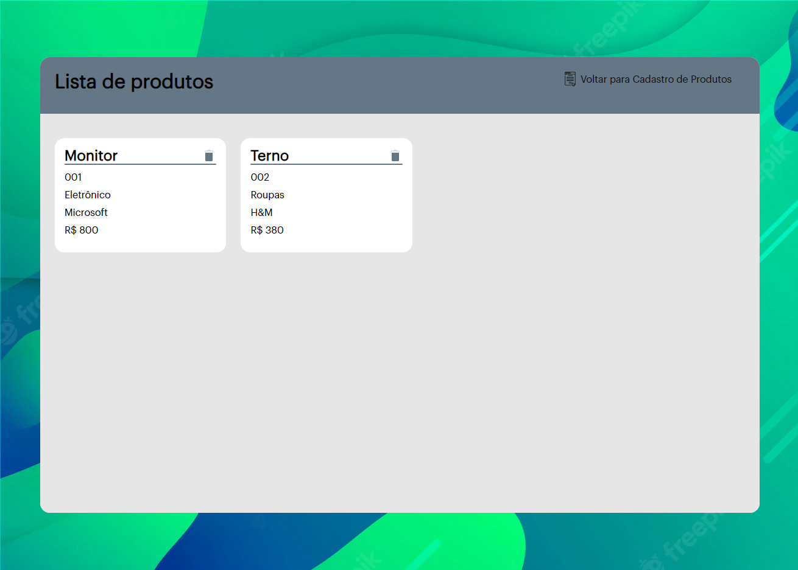

<p align="center">
	
</p>

<h1 align="center">Products Portal</h1>

## Status

<h4 align="center"> 
	Products Portal - In Progress 🚧
</h4>

## Description

It is an application where users can manage their products. Through it it is possible to:

1. Register products;
2. View the list of registered products;
3. Update data about a specific product;
4. Exclude products from the list.

## Content

-   [Status](#status)
-   [Description](#description)
-   [Content](#content)
-   [How to use it?](#how-to-use-it)
-   [Stack and Technoloy](#stack-and-technology)

## How to use it?

Products Portal is a front-end project.

1. Clone the repository

```
git clone https://github.com/ericiannj/products-portal.git
```

2. Install the front-end dependencies;

```
yarn
```

3. Run the code.

```
yarn start
```

## Imagens



