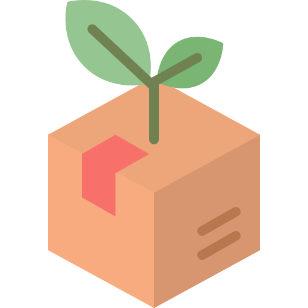
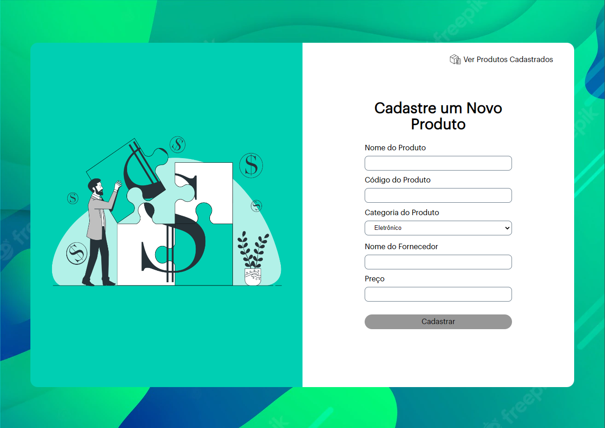
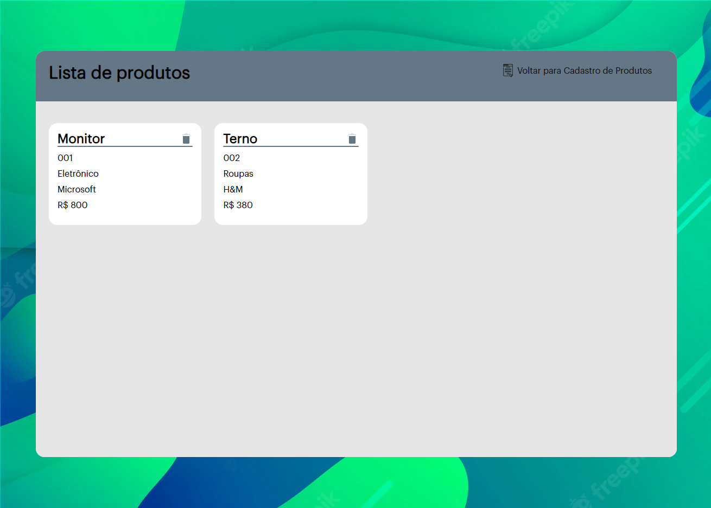

	

<h1 align="center">Desafio Front-End: Portal de Clientes</h1>

## Status

<h4 align="center"> 
	Portal de Clientes - Finalizado ✅
</h4>

## Descrição

Trata-se de uma aplicação destinada a clientes da James Tip que desejam gerenciar seus produtos. Por meio dela é possível:

1. Registrar produtos;
2. Ver a lista de produtos registrados;
3. Atualizar dados sobre um produto específico;
4. Excluir produtos da lista.

## Conteúdo

-   [Descrição](#descrição)
-   [Status](#status)
-   [Conteúdo](#conteúdo)
-   [Ferramentas](#ferramentas)
-   [Planejamento e Execução](#planejamento-e-execução)
-   [Imagens](#imagens)

## Ferramentas

-   Typescript: Utilização de tipagem estática durante o desenvolvimento da aplicação para facilitar o controle do fluxo dos dados necessários, além de utilidades como as sugestões de autocomplete.
-   React JS: Bibioteca Javascript que facilita a criação de interfaces de usuário por meio de sua base (componentes, propriedades e estado) + function componentes (estruturação dos componentes em forma de funções)
-   API Context: Criação de contextos para o compartilhamento de estados e funções com o intuito de evitar a sobrecarga de propriedades sendo passada entre os componentes (problema com prop drilling)
-   Styled Components: Possibilidade de componentizar as mais diversas estruturas HTML com o intuito de facilitar a estilização de componentes e possibilitar uma aplicação com maior facilidade de escalabilidade.

## Planejamento e Execução

1. Inicialmente se estabeleceu uma base (boilerplate) para se iniciar o projeto, utilizando ESLint/prettier/EditorConfig (padronização de código) + Commitlint/Commitzen (padronização de commits) + caminho absoluto (melhorar a leitura dos imports);

2. Em seguida, se priorizou estabelecer a estrutura básica de navegação para o usuário, dividindo em duas interfaces: Página de formulário + Página de produtos.

3. Com isso, foi possível estabelecer a lógica geral necesssária para a realização das atividades propostas (criação, listage, edição e exclusão de produtos).

4. A partir desse ponto, tornou-se interessante trabalhar na estilização geral, trazendo pontos que melhoram a experiência do usuário (imagens, paleta de cores, desabilitação de botões...)

5. Por fim, atentou-se a detalhes voltados para a finalização da documentação e outras questões voltadas a experiência, como a responsividade.

Apesar de estabelecer o projeto como finalizado (diante do prazo), seria possível continuar com melhorias, como:

-   Melhorias na responsividade
-   Possibilidade de adicionar imagens para cada produto
-   Melhorias na escolha das cores e das imagens
    (...)

## Imagens

